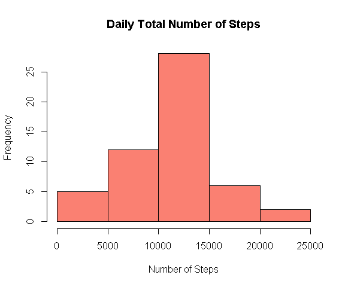
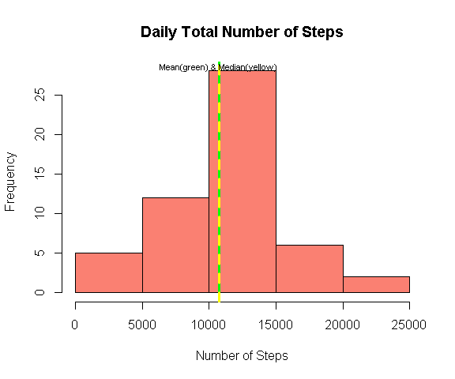
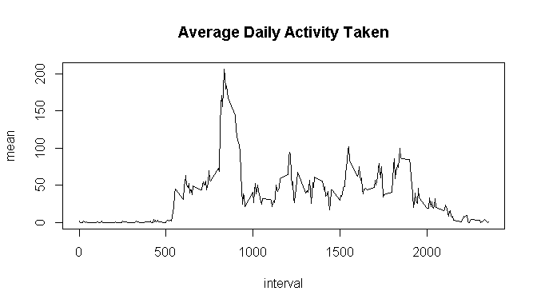
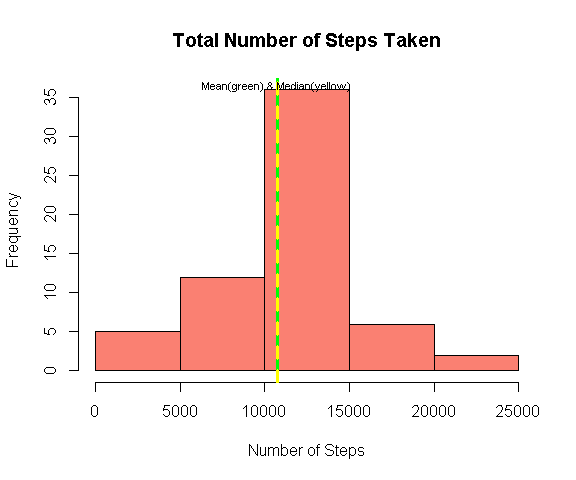
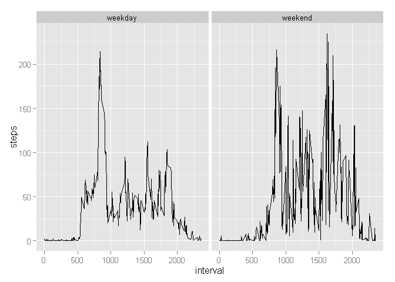

# Reproducible Research: Peer Assessment 1


## Loading and preprocessing the data


```r
activity <- read.csv("activity.csv",na.strings="NA")
activity$date <- as.Date(activity$date)
```


```r
library(dplyr,quietly=TRUE)    
```

```
## 
## Attaching package: 'dplyr'
## 
## The following objects are masked from 'package:stats':
## 
##     filter, lag
## 
## The following objects are masked from 'package:base':
## 
##     intersect, setdiff, setequal, union
```


## What is mean total number of steps taken per day?


```r
DailyTotal <-activity %>% filter(steps!="NA") %>% group_by(date) %>% summarise(Total = sum(steps))
hist(DailyTotal$Total, xlab="Number of Steps", main="Daily Total Number of Steps", col="salmon")
```

 


```r
DailyMean <- round(mean(DailyTotal$Total),2)
DailyMedian <- median(DailyTotal$Total)
```

The mean of the total number of steps taken per day is 10,766.19 and the median is 10765.


```r
hist(DailyTotal$Total, xlab="Number of Steps", main="Daily Total Number of Steps", col="salmon")
abline(v=DailyMean,lwd=3,col="green")
abline(v=DailyMedian,lty=2,lwd=3,col="yellow")
text(DailyMean,28.5,"Mean(green) & Median(yellow)",cex=0.7)
```

 


## What is the average daily activity pattern?

```r
IntervalMean <- activity %>% filter(steps!="NA") %>% group_by(interval) %>% summarise(mean = mean(steps))
with(IntervalMean, plot(interval, mean , type="l", lwd=1.5, main="Average Daily Activity Taken"))
```

 


```r
max <- IntervalMean[IntervalMean$mean == max(IntervalMean$mean), 1]
max <- as.numeric(max)     
```


On average across all the days in the dataset, the 835 interval contains the maximum number of steps. 


## Imputing missing values


```r
missingvalue <- sum(is.na(activity$steps))     
```

The total number of missing values in the dataset is 2304.


Since there are a lot of missing values in the dataset, the **mean for the 5-minute interval** will be filled in replacement for the missing value.


```r
ACTIVITY <- merge(activity, IntervalMean, by.x="interval", by.y="interval")
ACTIVITY[is.na(ACTIVITY$steps), 2] <- ACTIVITY[is.na(ACTIVITY$steps), 4]
ACTIVITY <- ACTIVITY %>% select(-4)
```


```r
DailyTotal2 <- ACTIVITY %>% filter(steps!="NA") %>% group_by(date) %>% summarise(Total = sum(steps))
DailyMean2 <- round(mean(DailyTotal2$Total),2)
DailyMedian2 <- median(DailyTotal2$Total)
```


The mean of the total number of steps taken per day is 10,766.19 and the median is 10,766.19.


```r
hist(DailyTotal2$Total, xlab="Number of Steps", main="Total Number of Steps Taken",col="salmon")
abline(v=DailyMean2,lwd=3,col="green")
abline(v=DailyMedian2,lty=2,lwd=3,col="yellow")
text(DailyMean,36.5,"Mean(green) & Median(yellow)",cex=0.7)
```

 


The mean of both datasets are equal however the median of the original dataset is slightly off from the median of the new dataset.

One of the advantages of imputing missing values is that days without values now have values. Furthermore, the median of the total number of steps taken per day in the original data is slightly off by 1 unit. However, when missing values were replaced by the mean for that interval, the median and mean of the total number of steps taken per day become equivalent. 


## Are there differences in activity patterns between weekdays and weekends?


```r
ACTIVITY$DayoftheWeek <- weekdays(ACTIVITY$date)
weekend <- ACTIVITY$DayoftheWeek==c("Saturday","Sunday")
ACTIVITY[weekend,4] <- "weekend"
weekday <- ACTIVITY$DayoftheWeek!="weekend"
ACTIVITY[weekday,4] <- "weekday"
```


```r
library(ggplot2) 
qplot(interval,steps,data=ACTIVITY,facets=.~DayoftheWeek,stat="summary",fun.y="mean",geom="line")
```

 
